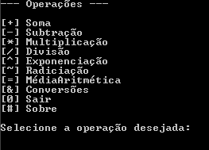

# 💮 **Projeto Final - Calculadora** 💮

## Descrição do projeto:

Uma calculadora com 7 operações aritméticas(adição, subtração, multiplicação, divisão, exponenciação, radiciação e média aritmética) e conversões em C# !

---

## Aparência do programa

 


---
 ## 🌠 _Download_
Segue abaixo o link para fazer o download:
 
 [✨ Operações .zip](dist/Operações.zip)

```
dotnet Projeto---Calculadora.dll
```
 ---

 ## Gratificações:

- [Ermogenes Palacio](https://github.com/ermogenes)
- [Diego Neri](https://github.com/diegoneri)
- [Etec Adolpho Berezin](http://eteab.com.br/cms/)


